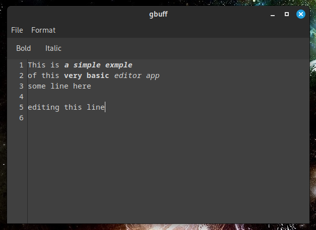

# gbuff - A Simple GTK Text Editor

gbuff is a lightweight text editor built with GTK and C, featuring basic text editing capabilities, line numbers, highlighting numbers in opened text and simple formatting options. 

Developed and tested on Fedora 40 Cinnamon

## Features

- Open and save text files
- Basic text formatting (bold, italic)
- Toggleable line numbers
- Syntax highlighting for numbers
- Monospace font for better code readability

## Installation

### Prerequisites
- GTK 3 development libraries
- GCC or other C compiler

### Linux
```bash
# Install dependencies (Ubuntu/Debian)
sudo apt-get install build-essential libgtk-3-dev

# or for Fedora
sudo dnf install gtk3-devel

# Compile
make

# Run
./gbuff #or simply click on generated executable
```

## Usage

1. **File Menu**:
    
    - Open: Open a text file
        
    - Save: Save the current text to a file
        
2. **Format Menu**:
    
    - Bold: Make selected text bold
        
    - Italic: Make selected text italic
        
    - Line Numbers: Toggle line number display
        
3. **Toolbar**:
    
    - Quick access to bold and italic formatting
        

## Screenshot


## Contributing

Contributions are welcome! Please fork the repository and submit a pull request.

## License

[MIT License](https://opensource.org/license/mit)
